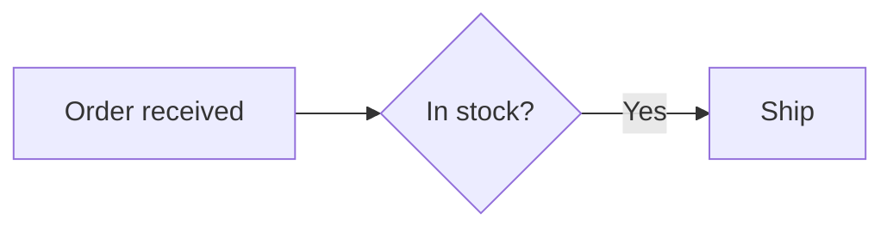
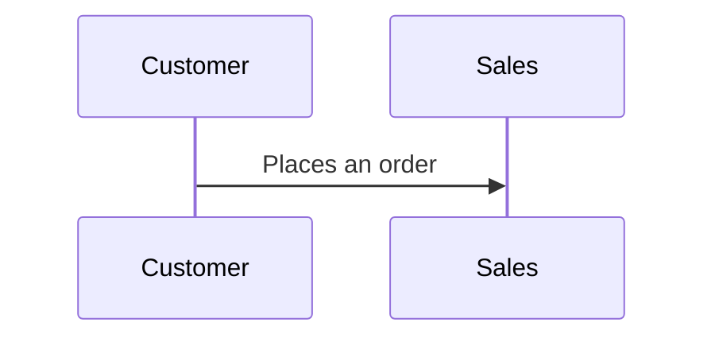

# Diagrams

```mermaid
flowchart LR
  A["Order received"] --> B{"In stock?"}
  B -- Yes --> C["Ship"]
```

```mermaid
sequenceDiagram
  Customer->>Sales: Places an order
```

```mermaid
flowchart LR
  A -->
  this is not a diagram ((
```
