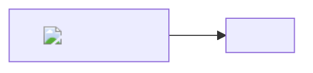
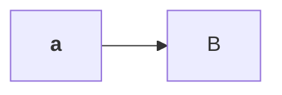
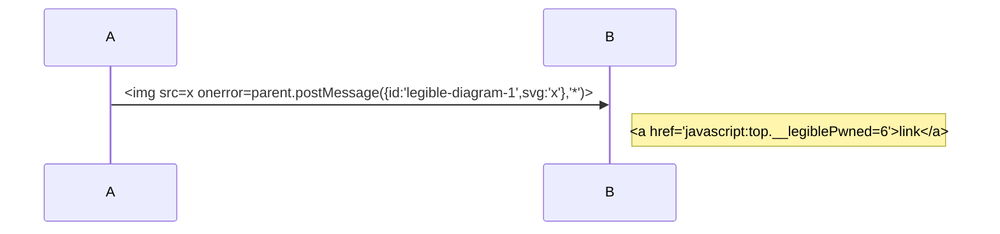
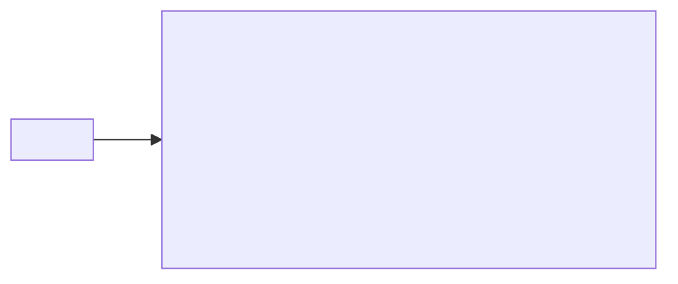

# Diagrams that try to get out

Each tries to run script, from its labels, a click, its own config or a link, and reach the page.

```mermaid
flowchart LR
  A["<img src=x onerror=&quot;top.__legiblePwned=1;parent.document.title='pwned'&quot;>"] --> B["<script>top.__legiblePwned=2</script>"]
```

```mermaid
%%{init: {"securityLevel": "loose", "startOnLoad": true}}%%
flowchart LR
  A["<b onmouseover=top.__legiblePwned=3>a</b>"] --> B
  click A href "javascript:top.__legiblePwned=4"
  click B call alert(5)
```

```mermaid
sequenceDiagram
  A->>B: <img src=x onerror=parent.postMessage({id:'legible-diagram-1',svg:'x'},'*')>
  Note right of B: <a href="javascript:top.__legiblePwned=6">link</a>
```

```mermaid
---
config:
  securityLevel: loose
  htmlLabels: true
---
flowchart LR
  A["<iframe srcdoc='<script>top.__legiblePwned=7</script>'></iframe>"] --> B["<svg onload=top.__legiblePwned=8>"]
```
